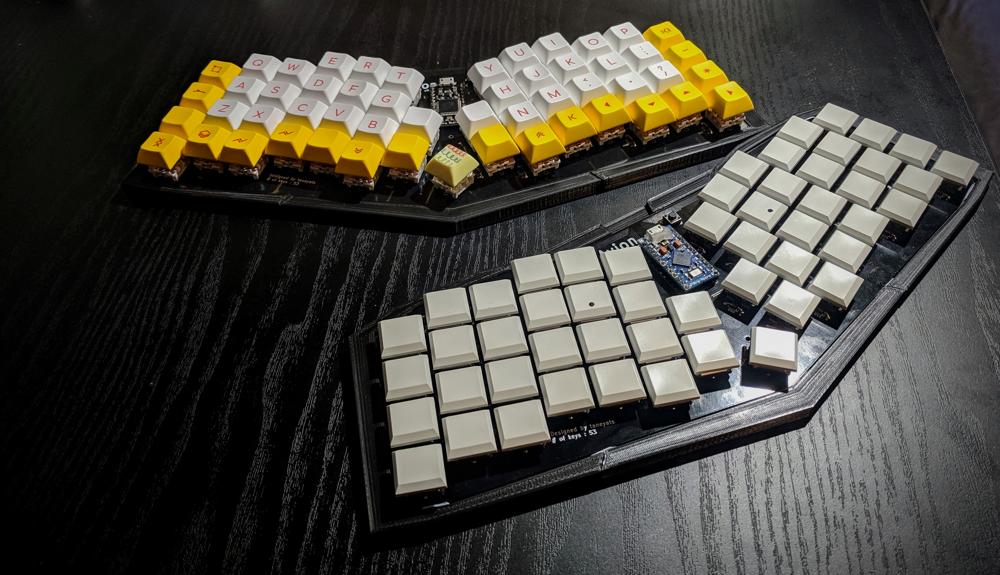

# Avion
An wing-like 53-key keyboard inspired by Atreus.

### Features
- has 53 keys.
- is column-staggered.
- Supports Kailh choc and Cherry MX and its compatibles.
- has a central display spot for an artisan keycap.

[More information is available here.](https://www.taneyats.com/entry/lets-see-my-avion)(Japanese)

### Beta Version
This project still have lots to be completed.